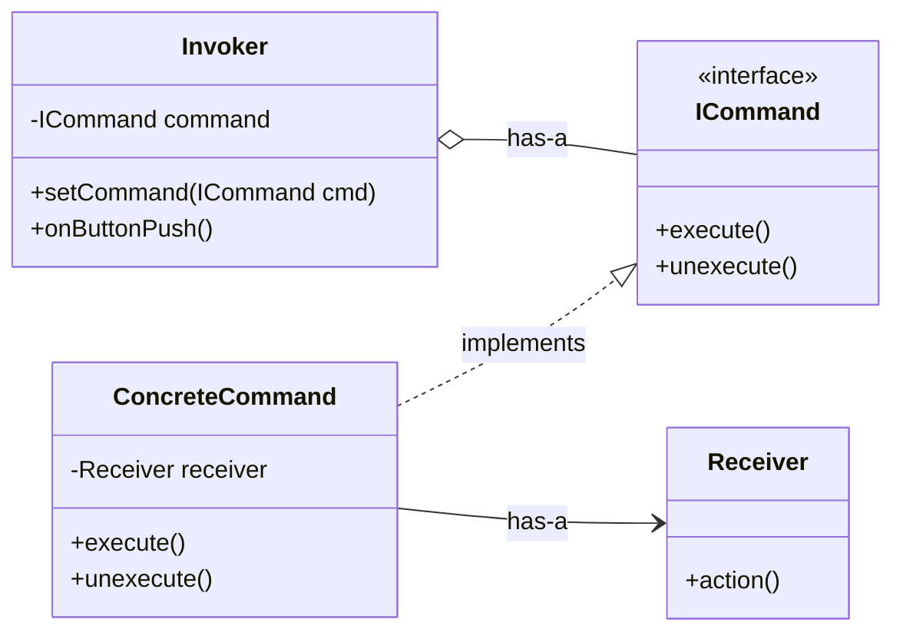

## The Command Pattern

The **Command Pattern** encapsulates a request as an object, thereby letting you parameterize other objects with different requests, queue or log requests, and support undoable operations.

The core idea is to turn a request or an action into a standalone object. Instead of one object calling a method directly on another, the caller creates a **command object** that contains all the information needed to perform the action and passes it to an **invoker**. The invoker then tells the command to `execute()` when the time is right.

-----

### The Actors in the Pattern

To understand the pattern, it's essential to know the four main roles involved, using the video's excellent smart home remote example:

1.  **The Receiver (`Light`)**: This is the object that performs the actual work. It knows how to carry out the request (e.g., a `Light` object knows how to turn itself on and off).
2.  **The Command (`LightOnCommand`)**: This object encapsulates the request. It holds a reference to the **Receiver** and implements a common `execute()` method. When `execute()` is called, the Command tells its Receiver to perform the action.
3.  **The Invoker (`RemoteControl`)**: This is the object that the client interacts with. It holds one or more **Command** objects but is completely decoupled from the **Receiver**. It doesn't know what the command does or who the receiver is; its only job is to trigger the command by calling `execute()`.
4.  **The Client (The Setup App)**: This is the application code that configures the system. It creates the Receiver, creates the Command (passing the Receiver to it), and gives the Command to the Invoker.

The key benefit is the **complete decoupling** of the Invoker from the Receiver. The remote control doesn't need to know anything about light bulbs; it only needs to know how to execute a generic "command." This means you could use the same remote control (Invoker) to control lights, thermostats, or coffee machines, simply by loading it with different command objects.

-----

### Structure of the Command Pattern

#### UML Diagram



  * The `Invoker` holds a reference to an `ICommand`.
  * The `ConcreteCommand` implements the `ICommand` interface.
  * The `ConcreteCommand` holds a reference to a `Receiver`.
  * When the `Invoker`'s action is triggered (`onButtonPush()`), it calls `command.execute()`.
  * The `ConcreteCommand`'s `execute()` method then calls `receiver.action()`.

-----

### Implementation Walkthrough

Let's build the smart home remote control using C\#-like pseudocode.

#### 1\. The Command Interface

All command objects will implement this interface. It defines the contract for executing an action and, importantly, for undoing it.

```csharp
public interface ICommand {
    void execute();
    void unexecute(); // For the undo functionality
}
```

#### 2\. The Receiver

This is the object that does the work. It's a plain object with no knowledge of the Command pattern.

```csharp
public class Light {
    public void on() {
        Console.WriteLine("Light is ON");
    }
    public void off() {
        Console.WriteLine("Light is OFF");
    }
}
```

#### 3\. A Concrete Command

This class binds a receiver to an action. It's configured with a `Light` object in its constructor.

```csharp
public class LightOnCommand : ICommand {
    private Light light; // The receiver

    // The constructor receives the object that will do the work
    public LightOnCommand(Light light) {
        this.light = light;
    }

    public void execute() {
        light.on(); // The command delegates the call to the receiver
    }

    public void unexecute() {
        light.off(); // The undo action is the inverse of the execute action
    }
}
```

*(You would create a similar `LightOffCommand` where `execute()` calls `light.off()` and `unexecute()` calls `light.on()`)*

#### 4\. The Invoker

The remote control is configured with command objects, not receivers.

```csharp
public class RemoteControl {
    private ICommand onCommand;
    private ICommand offCommand;
    private ICommand undoCommand; // To keep track of the last command

    // The invoker is configured with commands, not receivers
    public RemoteControl(ICommand on, ICommand off) {
        this.onCommand = on;
        this.offCommand = off;
    }

    public void onButtonWasPushed() {
        onCommand.execute();
        undoCommand = onCommand; // Save the last command for undo
    }

    public void offButtonWasPushed() {
        offCommand.execute();
        undoCommand = offCommand; // Save the last command for undo
    }


    public void undoButtonWasPushed() {
        if (undoCommand != null) {
            undoCommand.unexecute();
        }
    }
}
```

#### 5\. The Client (Putting It All Together)

The client code wires everything up.

```csharp
public class HomeAutomationApp {
    public static void main() {
        // 1. Create the receiver
        Light livingRoomLight = new Light();

        // 2. Create the commands and associate them with the receiver
        ICommand lightOn = new LightOnCommand(livingRoomLight);
        ICommand lightOff = new LightOffCommand(livingRoomLight); // Assumes this class exists

        // 3. Create the invoker and load it with commands
        RemoteControl remote = new RemoteControl(lightOn, lightOff);

        // 4. Simulate button presses
        remote.onButtonWasPushed();  // Output: Light is ON
        remote.offButtonWasPushed(); // Output: Light is OFF
        remote.undoButtonWasPushed(); // Output: Light is ON (undoes the last 'off' command)
    }
}
```

-----

### Advanced Features & Benefits

The true power of the Command pattern comes from treating actions as objects.

  * **Undo/Redo Functionality**: As shown in the example, implementing undo is straightforward. For a multi-level undo, like in Photoshop, the invoker can maintain a stack of executed commands. Pushing the undo button calls `unexecute()` on the command at the top of the stack and pops it, moving it to a "redo" stack.

  * **Queuing and Logging**: Since commands are objects, they can be stored in a queue for later execution, logged to a file for persistence, or sent across a network to be executed on a different machine.

  * **Macro Commands**: You can create a command that holds a list of other commands. Its `execute()` method would simply iterate through the list and call `execute()` on each one. This allows you to create complex, high-level operations from simple, primitive commands (e.g., a "Movie Night" command that dims the lights, closes the blinds, and turns on the TV). This is an application of the **Composite Pattern**.
