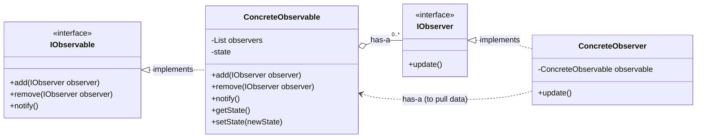
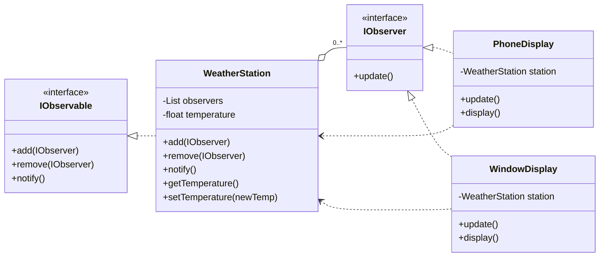

## The Observer Pattern

The **Observer Pattern** defines a one-to-many dependency between objects. When one object (the "observable" or "subject") changes its state, all of its dependents (the "observers") are notified and updated automatically.

The core intent is to create a subscription mechanism where multiple objects can monitor a single object for changes without being tightly coupled to it.

-----

### The Problem: Polling vs. Pushing

Imagine you have one object (a weather station) whose state changes over time, and several other objects (displays) that need to know about these changes.

#### Inefficient Approach: Polling

In a **polling** architecture, the displays would have to continuously ask the weather station for updates.

  * **Display 1:** "Have you changed?"
  * **Weather Station:** "No."
  * **Display 2:** "Have you changed?"
  * **Weather Station:** "No."
  * ... one millisecond later ...
  * **Display 1:** "Have you changed?"
  * **Weather Station:** "No."

This is incredibly inefficient. It wastes CPU cycles and network resources, and there's always a delay between the actual state change and its detection. Scaling this to many observers makes the problem even worse.

#### Efficient Solution: Pushing

The Observer pattern flips this model. It uses a **push** architecture. The observers register their interest with the weather station once. From then on, the weather station takes responsibility for notifying them *only when* a change occurs.

  * **Weather Station State Changes:** "Attention all registered displays\! My state has changed. Here's the new information."

This is far more efficient as communication only happens when necessary.

-----

### Formal Definition & Structure

> "The Observer pattern defines a **one-to-many dependency** between objects so that when **one object changes state**, all of its **dependents are notified and updated automatically**."

This relationship is implemented using interfaces to keep the components loosely coupled.

#### UML Class Diagram

Here is the general structure of the Observer pattern.



**Components:**

  * **IObservable (or Subject):** An interface that defines methods for managing observers.
      * `add(observer)`: Registers an observer to receive notifications.
      * `remove(observer)`: Unregisters an observer.
      * `notify()`: Notifies all registered observers of a state change.
  * **IObserver:** An interface with a single method that the observable calls to send a notification.
      * `update()`: The method called by the observable when its state changes.
  * **ConcreteObservable:** The class that implements the `IObservable` interface.
      * It maintains a collection (e.g., a list) of `IObserver` objects.
      * It contains the actual state that observers are interested in (e.g., `getState()`).
      * When its state changes, it calls its `notify()` method, which iterates through its list of observers and calls `update()` on each one.
  * **ConcreteObserver:** A class that implements the `IObserver` interface.
      * It contains the logic to execute when it is notified.
      * Crucially, in the **Push-Pull** model described, it holds a reference to the `ConcreteObservable`. This allows it to "pull" the specific data it needs from the observable inside its `update()` method.

-----

### Concrete Example: The Weather Station

Let's apply this pattern to a weather station that reports temperature changes to various displays.

#### UML Diagram for the Weather Station Example



#### Code Flow & Implementation

Here’s how the logic would work, presented in C\#-like pseudocode.

**Step 1: Define the Interfaces**

```csharp
// The interface for objects that can be observed
public interface IObservable {
    void add(IObserver observer);
    void remove(IObserver observer);
    void notify();
}

// The interface for objects that observe
public interface IObserver {
    void update();
}
```

**Step 2: Implement the Concrete Observable (`WeatherStation`)**

The `WeatherStation` manages a list of observers and the core data (temperature).

```csharp
public class WeatherStation : IObservable {
    private List<IObserver> observers = new List<IObserver>();
    private float temperature;

    public void add(IObserver observer) {
        observers.Add(observer);
    }

    public void remove(IObserver observer) {
        observers.Remove(observer);
    }

    public void notify() {
        // Call update() on every registered observer
        foreach (var observer in observers) {
            observer.update();
        }
    }

    // This method is called when a new measurement is available
    public void setTemperature(float newTemp) {
        this.temperature = newTemp;
        Console.WriteLine("WeatherStation: New temperature measured. Notifying observers.");
        notify(); // Notify observers about the change
    }

    // Method for observers to pull the data they need
    public float getTemperature() {
        return this.temperature;
    }
}
```

**Step 3: Implement a Concrete Observer (`PhoneDisplay`)**

The `PhoneDisplay` needs a reference to the `WeatherStation` so it can pull the temperature when notified. This reference is passed in via the constructor.

```csharp
public class PhoneDisplay : IObserver {
    private WeatherStation station; // A reference to the observable
    private float currentTemperature;

    // The observable is passed to the constructor
    public PhoneDisplay(WeatherStation weatherStation) {
        this.station = weatherStation;
    }

    public void update() {
        // Pull the new temperature from the station
        this.currentTemperature = station.getTemperature();
        Console.WriteLine("PhoneDisplay updated!");
        display();
    }

    public void display() {
        Console.WriteLine($"Phone Display: Temperature is now {currentTemperature}°C");
    }
}
```

**Step 4: Client Code - Putting It All Together**

This is how you would use the pattern.

```csharp
public class WeatherApp {
    public static void Main() {
        // 1. Create the observable (the weather station)
        WeatherStation weatherStation = new WeatherStation();

        // 2. Create observers and pass them the observable instance
        PhoneDisplay phoneDisplay = new PhoneDisplay(weatherStation);
        WindowDisplay windowDisplay = new WindowDisplay(weatherStation); // Assuming WindowDisplay is similar

        // 3. Register the observers with the observable
        weatherStation.add(phoneDisplay);
        weatherStation.add(windowDisplay);

        // 4. Simulate a change in the weather station's state
        weatherStation.setTemperature(25.5f);

        Console.WriteLine("\n--- A little while later ---");

        // 5. Simulate another change
        weatherStation.setTemperature(27.0f);
    }
}
```

-----

### Variations: Push-Pull vs. Push-Push

The example above uses a **Push-Pull** model.

  * **Push-Pull:** The observable **pushes** a generic notification (by calling `update()`). The observer is then responsible for **pulling** the data it needs from the observable.
      * **Advantage:** Very flexible. Observers only get the data they want, and you can add new methods to the observable without breaking existing observers.
      * **Disadvantage:** Observers are coupled to the concrete observable class (not just its interface) to call specific methods like `getTemperature()`.

An alternative is the **Push-Push** model.

  * **Push-Push:** The observable **pushes** the notification *and* the changed data directly to the observer through the `update` method's parameters (e.g., `update(float newTemperature)`).
      * **Advantage:** Observers do not need a reference back to the observable, leading to even looser coupling.
      * **Disadvantage:** The observable must decide what data to send, potentially sending information that some observers don't need. The `update` method signature can become bloated.
