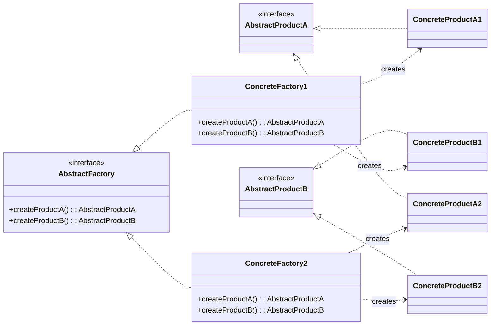

## The Abstract Factory Pattern

The **Abstract Factory Pattern** provides an interface for creating **families of related or dependent objects** without specifying their concrete classes.

Think of it this way: if a Factory Method is a factory for creating one type of product, an **Abstract Factory is a factory for creating other factories**, or more accurately, a single factory that groups multiple related factory methods together. It's a "super-factory."

-----

### The Key Difference: One Product vs. a Family of Products

The transition from Factory Method to Abstract Factory is simple but powerful.

  * **Factory Method:** A factory is responsible for creating **one** type of product. For example, a `ButtonFactory` creates `Button` objects.
  * **Abstract Factory:** A factory is responsible for creating a **whole family** of related products. For example, a `UIFactory` creates `Button` objects, `Window` objects, and `Label` objects.

The core idea is to ensure **consistency**. In many applications, you can't mix and match objects from different "families." For instance, you wouldn't want to use a macOS-style window with a Windows-style button inside it. An Abstract Factory enforces these rules by ensuring that a single factory instance can only produce objects from the same compatible family.

-----

### Formal Definition & Structure

> "The Abstract Factory pattern provides an interface for creating **families of related or dependent objects** without specifying their **concrete classes**."

Let's break this down:

  * **"Families of related or dependent objects":** This is the key. A `MacOSButton` and a `MacOSWindow` belong to the "macOS" family. A `DarkThemeButton` and a `DarkThemeLabel` belong to the "dark theme" family.
  * **"Without specifying their concrete classes":** The client code only interacts with the abstract factory (`UIFactory`) and the abstract products (`Button`, `Window`). It doesn't know or care if it's getting a `MacOSFactory` or a `WindowsFactory`. This allows you to swap out the entire family of objects at runtime by simply changing the concrete factory instance.

#### Evolving from Factory Method to Abstract Factory

The structure is a direct extension of the Factory Method pattern.

1.  **Start with a Factory Method:** You have a `Factory` interface with one method, `createProductA()`, which returns a `ProductA`.
2.  **Add More Factory Methods:** To make it an Abstract Factory, you simply add more creation methods for other related products, like `createProductB()`, which returns a `ProductB`.

That's it. The technical change is minimal, but the conceptual power is immense.

#### General UML Diagram



**Components:**

  * **AbstractFactory (`UIFactory`):** The interface that declares a set of factory methods for creating each product in the family (e.g., `createButton()`, `createWindow()`).
  * **ConcreteFactory (`MacOSFactory`, `WindowsFactory`):** Implements the `AbstractFactory` interface to create a specific family of concrete products. The `MacOSFactory` will only create `MacOSButton` and `MacOSWindow` objects.
  * **AbstractProduct (`Button`, `Window`):** The common interfaces for a type of product.
  * **ConcreteProduct (`MacOSButton`, `WindowsButton`):** The actual product implementations, specific to a family.

The crucial link is that a **single concrete factory** is responsible for creating a **full set of compatible concrete products**.

-----

### A Practical Example: UI Theming (Light vs. Dark Mode) 🎨

This is a perfect scenario for the Abstract Factory pattern. An application needs to support both a light and a dark theme. You cannot mix components from different themes—for example, white text (dark theme) on a white background (light theme) would be unreadable.

**The Solution:**

1.  **Define the Abstract Products:**

      * `interface Button { void render(); }`
      * `interface Label { void render(); }`

2.  **Define the Abstract Factory:**

      * `interface UIFactory { Button createButton(); Label createLabel(); }`

3.  **Create the Concrete "Light Theme" Family:**

      * `class LightButton implements Button { ... }`
      * `class LightLabel implements Label { ... }`
      * `class LightThemeFactory implements UIFactory {`
          * `public Button createButton() { return new LightButton(); }`
          * `public Label createLabel() { return new LightLabel(); }`
          * `}`

4.  **Create the Concrete "Dark Theme" Family:**

      * `class DarkButton implements Button { ... }`
      * `class DarkLabel implements Label { ... }`
      * `class DarkThemeFactory implements UIFactory {`
          * `public Button createButton() { return new DarkButton(); }`
          * `public Label createLabel() { return new DarkLabel(); }`
          * `}`

**How it's Used:**

At application startup, you decide which theme to use and create the corresponding factory.

```java
// User selects "Dark Mode" in settings
UIFactory factory = new DarkThemeFactory();

// All subsequent UI creation is done through this factory
// The client code has no idea it's creating dark theme components
Button okButton = factory.createButton();
Label usernameLabel = factory.createLabel();

okButton.render(); // Renders a dark-themed button
usernameLabel.render(); // Renders a dark-themed label
```

By passing around a single `factory` instance, you guarantee that every UI component created will belong to the same theme, ensuring a consistent user experience. Adding a new "Blue Theme" is as simple as creating a new family of products and a new concrete factory, without changing any of the client code that uses the factory.
