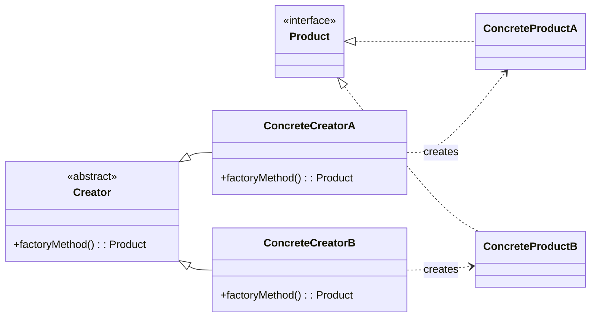

## The Factory Method Pattern

The **Factory Method Pattern** defines an interface for creating an object, but lets subclasses decide which class to instantiate. It allows a class to defer the responsibility of object creation to its subclasses, encapsulating the instantiation logic.

The main goal is to manage the creation of objects, moving the responsibility of *which* specific object to create out of the client code and into a dedicated "factory."

-----

### The Problem: Where Does `new` Belong?

In object-oriented programming, we constantly instantiate objects using the `new` keyword. The Factory Method pattern addresses the question of *where* and *how* this instantiation should happen.

Directly using `new` in your business logic can cause problems:

1.  **Tight Coupling:** Your code becomes tightly coupled to the specific concrete class you are instantiating. If you need to create a different type of object, you have to change the code.
2.  **Complex Creation Logic:** Instantiation isn't always simple. It might require complex calculations, randomization, or logic to determine which class to create or what parameters to pass to its constructor. Sprinkling this logic throughout your application leads to code duplication and maintenance headaches.

The solution is to **encapsulate object creation**. Just like you'd extract a complex algorithm into its own method, you extract complex creation logic into its own object: a **factory**.

-----

### Illustrative Example: National Park Simulator 🌲

Imagine we're building a simulator where we need to create different types of animals.

  * **The Products:** These are the objects we want to create. They all share a common interface or superclass, `Animal`. The concrete products are `Dog`, `Cat`, and `Duck`.
  * **The Creators (Factories):** These are the objects responsible for creating the animals. They all implement an `AnimalFactory` interface, which has a `createAnimal()` method.

We could have different creation strategies, each encapsulated in its own factory:

1.  **`RandomAnimalFactory`:** This factory's `createAnimal()` method uses a random number generator to decide whether to return a `new Dog()`, `new Cat()`, or `new Duck()`. This factory is **stateless**.
2.  **`BalancedAnimalFactory`:** This factory ensures that, over time, an equal number of each animal is created. Its `createAnimal()` method might randomly pick an animal, but then exclude that type from future randomizations until the other types have been created. This factory is **stateful**; it needs to track which animals have been created.

By using factories, the client code doesn't need to know *how* an animal is chosen; it just asks the factory for a new one. Plus, the client can be configured with either a `RandomAnimalFactory` or a `BalancedAnimalFactory` at runtime, completely changing the creation behavior without altering the client code itself. This is the power of polymorphism applied to object creation.

-----

### Formal Definition & Structure

> "The Factory Method pattern **defines an interface for creating an object**, but **lets subclasses decide which class to instantiate**. Factory Method lets a class **defer instantiation to subclasses**."

#### General UML Diagram



**Components & Responsibilities:**

  * **Product (`Animal`):** The common interface for the objects the factory will create. The client code will interact with objects through this interface.
  * **ConcreteProduct (`Dog`, `Cat`):** The actual classes that implement the `Product` interface. These are the objects we want to instantiate.
  * **Creator (`AnimalFactory`):** An abstract class or interface that declares the "factory method" (e.g., `createAnimal()`). This method's return type is the `Product` interface.
  * **ConcreteCreator (`RandomAnimalFactory`):** The class that implements the factory method. It contains the specific logic to decide which `ConcreteProduct` to instantiate and return.
    
```java
// Product interface
interface Product {
    void use();
}

// Concrete Products
class ProductA implements Product {
    public void use() {
        System.out.println("Using Product A");
    }
}

class ProductB implements Product {
    public void use() {
        System.out.println("Using Product B");
    }
}

// Factory interface
interface Factory {
    Product createProduct();
}

// Concrete Factories
class FactoryA implements Factory {
    public Product createProduct() {
        return new ProductA();  // returns Product reference
    }
}

class FactoryB implements Factory {
    public Product createProduct() {
        return new ProductB();
    }
}

// Client
public class Main {
    public static void main(String[] args) {
        Factory factory = new FactoryA();  // choose factory
        Product product = factory.createProduct(); // returns Product ref
        product.use(); // works polymorphically
    }
}
```

**Note on "Simple Factory":** A "Simple Factory" is often just a single concrete creator class without the abstract `Creator` interface. While it helps encapsulate creation logic, it is not considered a true design pattern because it misses the key benefit of polymorphism—the ability to swap out different factory implementations.
Simple Factory Pattern, you typically return the concrete product instead of the parent product type.
-----

### A More Powerful Example: Game Development 🚀

A great use case for the Factory Method pattern is in game development, for example, in an Asteroids-style game.

**Scenario:** The game needs to spawn asteroids continuously. As the player advances through levels, the asteroids should become more dangerous (larger, faster).

**Naive Approach:** Hard-code the logic for each level.

```java
// Inside the Level 5 game loop
if (shouldSpawn) {
    // Logic for fast, big asteroids
    new Asteroid(largeSize, highSpeed, randomPosition);
}
```

This is brittle and leads to code duplication across level classes.

**Factory Method Solution:**

1.  Create an `ObstacleFactory` interface with a `createAsteroid()` method.
2.  Instead of creating a new factory class for each level (`Level1Factory`, `Level2Factory`, etc.), create a single, powerful, **parameterized factory**.
3.  The factory can be configured with the current level's difficulty.

<!-- end list -->

```java
public class DynamicAsteroidFactory implements ObstacleFactory {
    private int level;

    public DynamicAsteroidFactory(int currentLevel) {
        this.level = currentLevel;
    }

    public Asteroid createAsteroid() {
        // Use the level parameter to calculate asteroid properties
        float speed = 5.0f * level;
        float size = 10.0f * (float)Math.random() * level;
        // ... more logic

        return new Asteroid(size, speed, randomPosition());
    }
}
```

Now, the main game class doesn't need to know anything about asteroid creation. It just instantiates a new `DynamicAsteroidFactory` at the start of each level and calls `createAsteroid()` inside the game loop.

This elegantly separates the **game logic** (running the loop, moving objects) from the **creation logic** (determining how difficult the next asteroid should be). It's a perfect example of supporting **composition over inheritance** and the **Open/Closed Principle**. You can change the entire difficulty curve of your game by only modifying the factory, without touching any of the level or game loop code.
