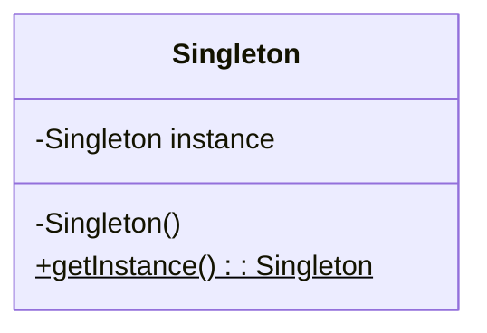

## The Singleton Pattern

The **Singleton Pattern** ensures a class has **only one instance** and provides a **global point of access** to it.

It's a pattern that is technically interesting but is now widely considered a **code smell** or an **anti-pattern** by many developers for reasons discussed below. It's important to understand how it works, but you should be extremely cautious about using it in modern software development.

-----

### ⚠️ Why Singleton is Often Criticized

Before looking at the implementation, it's crucial to understand the strong arguments against using the Singleton pattern.

1.  **It Introduces Global State:** One of the first principles of good software design is to avoid global variables. Global state makes a program difficult to reason about because any part of the application can modify the object at any time, leading to unpredictable behavior and hard-to-find bugs. It creates hidden dependencies between distant parts of your code.

2.  **It Makes a Dangerous Assumption:** The pattern forces the assumption that you will *only ever* need one instance of a class, for the entire lifetime of the application. This assumption is often proven wrong as requirements evolve. The example is a `Chat` application: you might start with one global chat room (a Singleton), but later need to support multiple chat rooms, a change the Singleton pattern makes very difficult to implement.

3.  **It Violates the Single Responsibility Principle (SRP):** A class should have only one reason to change. A Singleton class is responsible for its primary business logic (e.g., managing a chat) *and* for managing its own lifecycle (ensuring only one instance is ever created). These are two separate responsibilities.

4.  **It Hinders Testability:** Code that relies on Singletons is difficult to unit test. Since you can't easily swap out the global instance with a mock or a fake version, your tests become dependent on the real implementation. This makes it hard to test components in isolation and can lead to slow, brittle, and interdependent tests.

A better approach is often to create a single instance of a class at the application's starting point and pass it to the objects that need it through their constructors (**Dependency Injection**). This gives you the benefit of having a single object without the downsides of a globally enforced Singleton.

-----

### The Technical Implementation

The cleverness of the Singleton pattern comes from its use of access modifiers and static members to control instantiation.

#### The Three Key Ingredients:

1.  A **private constructor**, which prevents any external code from creating an instance of the class using the `new` keyword.
2.  A **private static variable** of the class's own type, which holds the single, unique instance.
3.  A **public static method** (commonly named `getInstance()`), which acts as the global access point. It's responsible for creating the instance the very first time it's called and returning that same instance on all subsequent calls.

#### UML Diagram



*Note: The `$` symbol in Mermaid indicates a static member.*

-----

### Pseudocode Implementation

Here is a common implementation of the Singleton pattern using "lazy initialization," where the instance is not created until it is first needed.

```java
public class Singleton {

    // 1. The private static variable that will hold the single instance.
    // It's initialized to null.
    private static Singleton instance = null;

    // 2. The private constructor. No one outside this class can call this.
    private Singleton() {
        // Initialization code for the object, if any.
        System.out.println("Singleton instance created.");
    }

    // 3. The public static method that provides the global access point.
    public static Singleton getInstance() {
        // "Lazy initialization": create the instance only if it doesn't exist yet.
        if (instance == null) {
            // This part is only executed the very first time getInstance() is called.
            instance = new Singleton();
        }
        // Return the one and only instance.
        return instance;
    }

    // Other methods for the Singleton's business logic would go here.
    public void doSomething() {
        System.out.println("Singleton is doing something.");
    }
}
```

#### How to Use It

Client code cannot use `new`. Instead, it must always go through the `getInstance()` method.

```java
public class Main {
    public static void main(String[] args) {
        // This is not allowed because the constructor is private:
        // Singleton s = new Singleton(); // COMPILE ERROR!

        // Get the one and only instance of the Singleton
        Singleton s1 = Singleton.getInstance();
        s1.doSomething();

        // Get the instance again...
        Singleton s2 = Singleton.getInstance();
        s2.doSomething();

        // Verify that s1 and s2 are the exact same object
        if (s1 == s2) {
            System.out.println("s1 and s2 are the same instance. Success!");
        }
    }
}
```

**Expected Output:**

```
Singleton instance created.
Singleton is doing something.
Singleton is doing something.
s1 and s2 are the same instance. Success!
```

Notice that "Singleton instance created" is only printed once, proving that the constructor was only ever called a single time, no matter how many times `getInstance()` was invoked.
