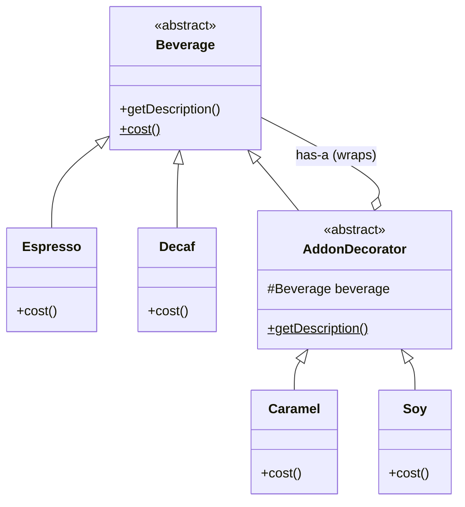
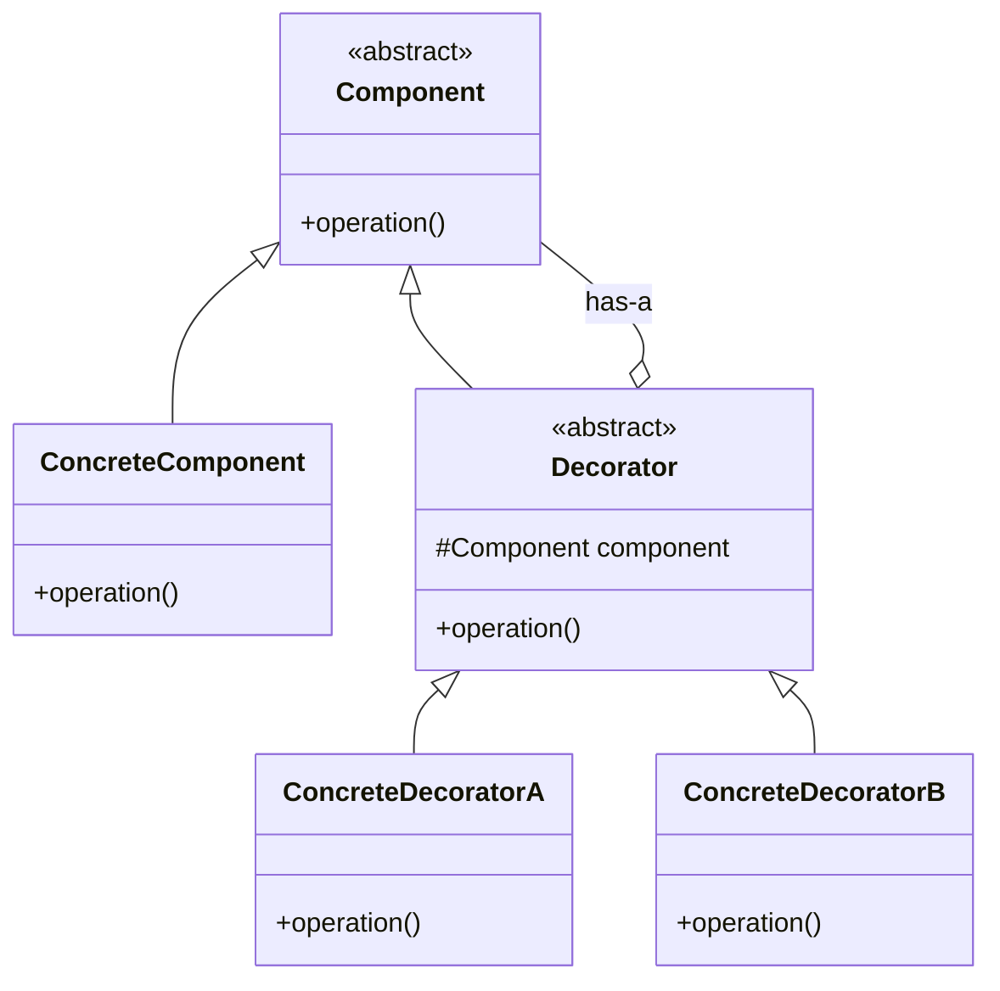

## The Decorator Pattern

The **Decorator Pattern** attaches additional responsibilities or behaviors to an object **dynamically** at runtime. It provides a flexible alternative to subclassing for extending functionality, allowing you to "wrap" an object with one or more "decorators" that add their own behavior before or after delegating the call to the wrapped object.

-----

### Core Concept: "Is-A" and "Has-A"

The genius of the Decorator pattern lies in a simple but powerful relationship. A decorator object conforms to the same interface as the object it decorates.

  * A Decorator **Is-A** component (it shares the same interface or superclass). This allows it to be used anywhere the original component can be used, making the wrapping process transparent to the client.
  * A Decorator **Has-A** component (it holds a reference to the object it is wrapping). This allows it to delegate calls to the wrapped object.

This structure creates a chainable, layered architecture, much like Russian nesting dolls. You send a message to the outermost doll (decorator), which does something, then passes the message to the doll inside it, and so on, until it reaches the core object. The result is then passed back up the chain.

-----

### The Problem: Extending Functionality

The video uses the example of a coffee shop, "Starbuzz," to illustrate the problem that Decorator solves.

**Scenario:** We have a base `Beverage` class and different types of coffee like `Espresso` and `Decaf`. The challenge is adding various condiments (extras) like *Soy Milk*, *Caramel*, and *Whipped Cream*, which also affect the total cost.

#### Bad Solution \#1: Class Explosion via Subclassing

One naive approach is to create a specific class for every possible combination.

  * `EspressoWithCaramel`
  * `EspressoWithSoy`
  * `DecafWithCaramelAndSoy`
  * `DecafWithDoubleCaramel`

This leads to a **class explosion**—an unmanageable number of classes that are difficult to maintain.

#### Bad Solution \#2: Booleans in the Superclass

Another approach is to add boolean flags to the base `Beverage` class.

```java
abstract class Beverage {
    boolean hasSoy;
    boolean hasCaramel;
    boolean hasWhip;
    // ...

    public double cost() {
        double total = ...;
        if (hasSoy) total += 0.10;
        if (hasCaramel) total += 0.15;
        // ... complex conditional logic
        return total;
    }
}
```

This design is also deeply flawed:

1.  **Violates Open/Closed Principle:** Adding a new condiment (e.g., Chocolate) requires modifying the existing `Beverage` class.
2.  **Forces Unwanted Methods:** A `Tea` subclass would inherit `hasWhip()`, which might be irrelevant, violating the Interface Segregation Principle.
3.  **Doesn't Scale:** How do you handle a "double" shot of caramel? An integer `caramelCount`? This makes the `cost()` logic even more complex and brittle.

-----

### The Decorator Solution for Starbuzz Coffee

The Decorator pattern elegantly solves this by modeling condiments as objects that wrap a beverage.

#### UML Diagram for the Coffee Example



**How it Works:**

1.  **`Beverage`** is the abstract component that defines the common interface (`cost()`, `getDescription()`).
2.  **`Espresso`** and **`Decaf`** are concrete components—the base objects we want to decorate.
3.  **`AddonDecorator`** is an abstract decorator. It **is a** `Beverage` (by inheriting from it) and **has a** `Beverage` (by holding a reference to the object it wraps).
4.  **`Caramel`** and **`Soy`** are concrete decorators. They add their specific cost to the cost of the beverage they are wrapping.

The implementation of `cost()` in a decorator looks like this:

```java
// Inside the Caramel class
public double cost() {
    // Get the cost of the thing I'm wrapping, then add my own cost.
    return beverage.cost() + 0.15;
}
```

-----

### Generalized Structure and Code

#### General UML Diagram



#### Pseudocode Implementation

Here's how to build and use the coffee example.

```java
// === ABSTRACT CLASSES ===
public abstract class Beverage {
    public abstract double cost();
}

public abstract class AddonDecorator extends Beverage {
    // Reference to the object being decorated
    protected Beverage beverage;
}

// === CONCRETE COMPONENTS ===
public class Espresso extends Beverage {
    public double cost() {
        return 1.99; // Base price
    }
}

// === CONCRETE DECORATORS ===
public class Caramel extends AddonDecorator {
    public Caramel(Beverage beverage) {
        this.beverage = beverage; // Set the beverage to wrap
    }

    public double cost() {
        // Delegate to the wrapped object, then add our cost
        return beverage.cost() + 0.15;
    }
}

// === CLIENT CODE ===
public class Starbuzz {
    public static void main(String[] args) {
        // Order a simple espresso
        Beverage myCoffee = new Espresso();
        System.out.println("Cost: " + myCoffee.cost()); // Output: 1.99

        // Now, let's decorate it!
        // Wrap the Espresso object in a Caramel decorator
        myCoffee = new Caramel(myCoffee);
        System.out.println("Cost: " + myCoffee.cost()); // Output: 2.14 (1.99 + 0.15)

        // We can decorate a decorator! Wrap the Caramel-decorated coffee with another Caramel
        myCoffee = new Caramel(myCoffee);
        System.out.println("Cost: " + myCoffee.cost()); // Output: 2.29 (2.14 + 0.15)
    }
}
```

-----

### Critique and Better Use Cases

The video makes an excellent point: **the coffee example is a great illustration of the pattern's mechanics, but it might be over-engineering for this specific problem.**

A simpler solution might be a `Beverage` class that holds a list of `Condiment` objects and calculates the total cost by iterating over them. The Decorator pattern truly shines when the decorators add **significantly different behavior**, not just a value from a single property (like cost).

#### More Suitable Use Cases

1.  **Java I/O Streams:** This is the classic, real-world example. You start with a base `FileInputStream` (the component) and can wrap it with decorators that add new behaviors:

      * `BufferedInputStream`: Adds buffering for performance.
      * `LineNumberInputStream`: Adds the ability to track line numbers.
      * `GZIPInputStream`: Adds decompression functionality.
      * You can compose them: `new LineNumberInputStream(new BufferedInputStream(new FileInputStream("file.txt")))`.

2.  **Deprecating Code Gracefully:** Imagine you have a class that's used everywhere, but you want to phase it out. You can create a decorator that wraps the old class. In some places, you can use the decorated version, which might log a warning, reroute the call, or modify the behavior, while other parts of the system continue to use the original, undecorated version. This allows for a gradual transition.
